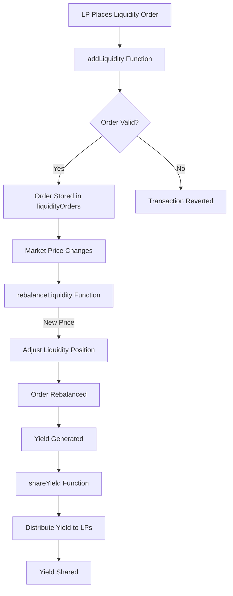

# Market-Making Bot for LBAMM Pools

## Overview

This contract implements a **market-making bot** for managing LP (Liquidity Provider) liquidity in LBAMM pool types. The bot functions similarly to an order book, allowing LPs to add, remove, and rebalance liquidity at specific price levels. Additionally, it shares the yield (fees earned) generated from trading activity proportionally to LPs based on their liquidity contributions.

### Key Features:
- **Order Book-Style Liquidity Management**: LPs can place liquidity at different price levels, similar to an order book.
- **Automated Rebalancing**: The bot repositions liquidity based on the current market price to maximize fee generation.
- **Yield Sharing**: Automatically distributes fees earned by the pool proportionally to LPs.
- **Customizable Liquidity Orders**: LPs can manage their liquidity at specified price levels and remove liquidity when needed.

## How It Works

The contract allows LPs to add liquidity to specific price ranges in a pool (mimicking an order book model). Liquidity positions are adjusted dynamically based on the market’s current price to ensure that LPs are exposed to the best possible conditions for generating trading fees. The bot also calculates and distributes the yield generated by the pool proportionally to LPs.

### Workflow Diagram



### Pool Example:
- LPs can add liquidity orders at specific price points (e.g., $1000 or $1500) and have those positions automatically adjusted based on current market conditions.
- Yield (fees generated from trading activity) is distributed automatically based on the amount of liquidity each LP provides.

## Installation

To set up and deploy the **Market-Making Bot** contract:

1. **Clone the Repository**:
   ```bash
   git clone https://github.com/0xsksingh/market-making-bot.git
   cd market-making-bot
   ```

2. **Install Dependencies**:
   Install the necessary Solidity and JavaScript dependencies using Hardhat:
   ```bash
   npm install
   ```

3. **Compile the Contract**:
   ```bash
   npx hardhat compile
   ```

4. **Deploy the Contract**:
   Deploy the contract to your desired blockchain network (e.g., Ethereum, Binance Smart Chain):
   ```bash
   npx hardhat run scripts/deploy.js --network <network-name>
   ```

## Usage

### Adding Liquidity Orders

To add liquidity at a specific price level, LPs can use the `addLiquidity` function. This function accepts parameters such as the amount of liquidity and the price at which to place it.

```solidity
addLiquidity(address provider, uint256 amount, uint256 price)
```

### Rebalancing Liquidity

The `rebalanceLiquidity` function can be called to adjust liquidity positions when the market price changes. This ensures LPs’ liquidity is optimally positioned.

```solidity
rebalanceLiquidity(address provider, uint256 newPrice)
```

### Removing Liquidity

To remove liquidity from a specific price level, LPs can use the `removeLiquidity` function, which will adjust their liquidity orders.

```solidity
removeLiquidity(address provider, uint256 amount, uint256 price)
```

### Yield Sharing

The contract calculates and shares the yield generated by trading fees among LPs using the `shareYield` function. This distributes the rewards proportionally based on each LP's share of the total liquidity.

```solidity
shareYield()
```

### Contract Events

- **LiquidityAdded**: Emitted when liquidity is added by an LP.
- **LiquidityRemoved**: Emitted when liquidity is removed by an LP.
- **YieldShared**: Emitted when yield is distributed to LPs.

## Functions

- `addLiquidity(address provider, uint256 amount, uint256 price)`: Adds liquidity for an LP at a specific price level.
- `rebalanceLiquidity(address provider, uint256 newPrice)`: Rebalances liquidity orders based on the new price.
- `removeLiquidity(address provider, uint256 amount, uint256 price)`: Removes liquidity for an LP from a specific price point.
- `shareYield()`: Distributes yield (fees) generated by the pool among LPs.

## Security Considerations

- **Yield Calculation**: The contract ensures fair distribution of yields based on the proportional liquidity each LP provides.
- **Rebalancing Logic**: The bot can adjust liquidity orders to new price levels, ensuring that liquidity is always optimally positioned based on market conditions.

## Future Enhancements

- **Dynamic Fee Calculation**: Incorporate additional factors for yield calculations, such as trading volume and time-weighted liquidity contributions.
- **Cross-Chain Support**: Explore integration with cross-chain solutions (e.g., LayerZero) to allow market-making across different blockchains.
- **Advanced Yield Models**: Implement more complex yield models that account for historical liquidity provision, volatility, and LP risk exposure.

## Contributing

We welcome contributions to improve the functionality and security of the **Market-Making Bot**. Please follow the standard GitHub flow for contributions:

1. Fork the repository.
2. Create a new branch.
3. Commit your changes.
4. Submit a pull request.

## License

This project is licensed under the MIT License. See the [LICENSE](./LICENSE) file for details.